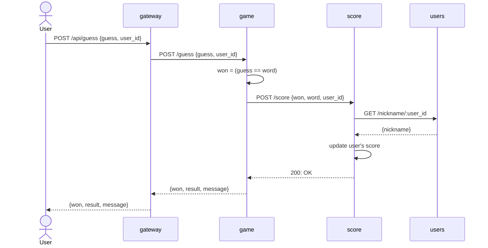
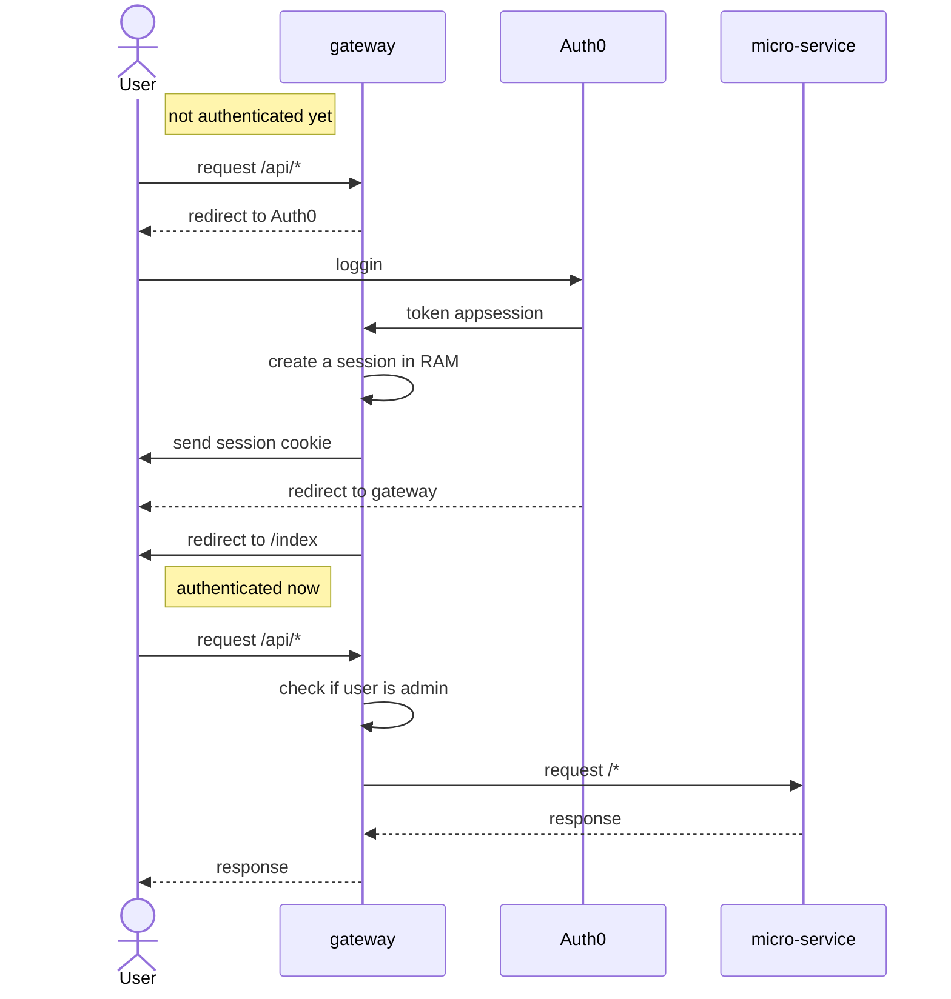

# Project Overview

| Contributors:     |
| ----------------- |
| _SAGDULLIN Damir_ |
| _TABBAH Nicola_   |
| _LAIOLO Léo_      |

## What the Project Does

This project consists of a game called "Motus". The application is implemented using microservices gateway architecture. Please read sections below for more details.

## Demo

https://github.com/DamirSagdullin/ING3-Microservices-Project/assets/98918068/bf2d199a-b838-4fca-a740-b6fe3d77d98f

## Features list

- `/cleanup_data.sh` script to clean application data from volumes
- only necessary ports are exposed to users
- healthchecks for postgres and redis
- secrets are in `/.env`
- initPg, prometheus and haproxy configs as well as databases data are bound as volumes in `/volumes/`
- `PostgresConnection.js` script to wait for postgres to be available before launching users microservice
- centralized postgres and redis access points : users and scores microserivces
- all microserivces use helmet, especially front accepting only necessary ressources
- errors are caught in trycatch and handled with proper codes and messages
- routes respect REST API format
- expose and protect APIs to play the game
- visit [localhost:3000/api/docs](http://localhost:3000/api/docs) for Swagger UI. declared in `/motus-gateway/routes/apiRoutes.js`
- use Auth0 to manage authentification and authorization. Admin role is required to be able to use APIs that can affect other users than the one logged in.
- haproxy reverse proxy and loadbalancing to 2 gateway microservices with IP stickiness.
- leaderboard by total and avg scores
- gateway separate front and api routes
- postgress keeps ids, logins and seeds of user that were registered/connected with auth0
- each user has a dedicated seed and thus word to guess that he can change using ui/api
- rate limiter of [localhost:3000/api/guess](http://localhost:3000//api/guess) route : 10 guesses per 20 seconds
- user can reset his score
- user can see his place highlighted in leaderboard ui if he's in top10
- use http-proxy-middleware to forward user requests for front pages
- use ejs as template language
- unique navbar file for logged out and logged in users idem for regular and admin users
- 404 page
- common imports.ejs file grouping cdn imports
- pretty error, success and info alerts instead of ugly browser default alerts
- simple declarative ui style using bootstrap
- icons using fontAwesome
- monitoring metrics and logs

## How to install

To get this project up and running on your local machine, follow these steps:

1. **Prerequisites**: Ensure that Docker Compose is installed and the Docker engine is running on your machine. You can download and install latest version from the [official Docker website](https://www.docker.com/products/docker-desktop/). Verify that you have Docker Compose with:

   ```bash
   docker compose version
   ```

2. **Clone the Repository**: Clone this repository to your local machine using the following command in your terminal:

   ```bash
   git clone https://github.com/DamirSagdullin/ING3-Microservices-Project
   ```

3. **Move into the Project**: Move into the project's folder `ING3-Microservices-Project`:

   ```bash
   cd ./ING3-Microservices-Project/
   ```

4. **Change Ownership of Volumes Directory**: The Docker daemon needs to have the necessary permissions to access the directories on your host machine that are being mounted as volumes in your Docker containers:

   ```bash
   sudo chown -R $USER:$USER ./volumes
   ```

5. **Build the Project**: Write the following command:

   ```bash
   docker compose build
   ```

## How to run

1. **Build and Run the Project**: Navigate to the root directory of the project in your terminal and run the following command:

   ```bash
   docker compose up -d
   ```

   This runs the containers in detached mode.

2. **Access the Game**: Open your web browser and navigate to [localhost:3000](http://localhost:3000) to start playing the game.

3. **_Enjoy the game!_**

> **Note**: You can cleanup application data by executing `cleanup_data.sh` script. This will remove all data in `./volumes/data` directory. But it will not cleanup users from Auth0.

## How to see logs

To see application logs, follow those steps:

### I. Setup Datasources

1. **Run the application**: Follow the steps of the section below if the application is not running yet.

2. **Access to Grafana**: Open your web browser and navigate to [http://localhost:3005](http://localhost:3005).

3. **Login**: By default, the user and password are:
   | | |
   |-|-|
   | username: | `admin` |
   | password: | `admin` |

4. **Change the password (if needed)**: Skip or put any password you want.

5. **Go to Datasource section**: Click on _Datasource_ in the home menu.

6. **Add _Loki_ as a datasource**: Select _Loki_ in the list of allowed datasources.

7. **Connect to _Loki_**: Set _Connection URL_ to `http://loki:3100` .

8. **Save setups**: Click on the button `Save & Test`, at the page's bottom.

9. **Go back to DataSource section**: Click on _Datasource_ in the home menu.

10. **Add _Prometheus_ as a datasource**: Select _Prometheus_ in the list of allowed datasources.

11. **Connect to _Prometheus_**: Set _Connection URL_ to `http://prometheus:9090` .

12. **Save setups**: Click on the button `Save & Test`, at the page's bottom.

### II. Explore logs

1. **Go to _Explore_ menu**: Go back to the main menu, open the side bar then click on _Explore_.

2. **Explore logs**: Select the datasource _Loki_.

3. **Show motus logs**: Click on `Label browser`. Select the app `motus_logger` then press `Show logs`. You should see logs at the bottom of the web page.

4. **Explore metrics**: Select the datasource _Prometheus_.

5. **Show motus metrics**: Write the following code in the query bar:
   ```js
   http_requests_leaderbord_total{job=~"motus-leaderbord-1|motus-leaderbord-2"}
   ```

### III. Available logs and metrics

#### Logs

Here is a table of what logs are generated by the application:

| Message                      | Type    | Occurs                                                           |
| ---------------------------- | ------- | ---------------------------------------------------------------- |
| `URL not found`              | ERROR   | A user try to access to a non existing URL                       |
| `User authentication failed` | ERROR   | The auth0 authentication is not working                          |
| `Too many requests`          | WARNING | A user guess words too fast (more than 10 guesses in 20 seconds) |
| `User reset scores`          | WARNING | A user reset its scores                                          |
| `A user won`                 | INFO    | A user won a game                                                |
| `Starting app...`            | INFO    | `motus-gateway`, `motus-game` and `motus-front` start            |

#### Metrics

Here is a table of the metrics generated by the application:

| Job name             | Description                                                                                                                   |
| -------------------- | ----------------------------------------------------------------------------------------------------------------------------- |
| `prometheus`         | Metrics about Prometheus                                                                                                      |
| `node-exporter`      | Hardware- and kernel-related metrics                                                                                          |
| `motus-leaderbord-1` | Number of requests made to display the leaderbord and number of errors that occured during the process, on the first gateway  |
| `motus-leaderbord-2` | Number of requests made to display the leaderbord and number of errors that occured during the process, on the second gateway |

## How it works

This project is composed of several microservices. Their interaction are illustrated in schemes below:

### Functional


### Monitoring


### Micro-Services

#### Front-end

- **Path**: `motus-front/`

- **Role**: The `motus-front` microservice is responsible for the user interface of the application. It uses ejs template pages from `views/` folder. Javascript files from `public/js/` are using jquery to make requests to API. Finally main `app.js` serves front routes and makes necessary requests to other microservises to gather information.

#### Game

- **Path**: `motus-game/`

- **Role**: The `motus-game` microservice is responsible for the game logic. It generates and manages the game words and seeds. Also it handles word guessing process. The main `app.js` in this service reads a list of words from `data/liste_francais_utf8.txt` file, generates a seed for the game, and provides relevant endpoints.

#### Gateway

- **Path**: `motus-gateway/`

- **Role**: The `motus-gateway` microservice is the entry point of the application. It handles user authentication and routing. The main `app.js` in this service uses `express-openid-connect` middleware for `auth0` user authentication. The service has two main routes: /api for API requests and / for front-end requests. `routes/frontRoutes.js` forwards front-end requests to `motus-front` microservice. And `routes/apiRoutes.js` orchestrates requests between microservices and defines [localhost:3000/api/docs](http://localhost:3000/api/docs) route that implements swagger ui for endpoints in `routes/apiRoutes.js`.

#### Score

- **Path**: `motus-score/`

- **Role**: The `motus-score` microservice is responsible for managing and storing the scores of the game. It uses Redis as its database to store user scores (wins and tries). The main app.js in this service provides several endpoints for managing scores: setting, getting, resetin and getting leaderboards.

- **Database**: Redis

#### Users

- **Path**: `motus-users/`

- **Role**: The `motus-users` microservice is responsible for managing user data. It uses postgres as its database to store user information such as user_id, nickname, and seed. We keep this information in local to not use paid features of Auth0. The main `app.js` in this service provides several endpoints for managing users. Also it uses `PostgresConnection.js` to wait for postgres to be ready to accept requests before launching the microservice.

- **Database**: PostgreSQL

#### Monitoring

There are several entities that make monitoring. Their aim is to centralize logs and metrics about some micro-services of the application. The monitoring entities are described in the table below.

| Entity          | Path                                                     | Role                                                                                  |
| --------------- | -------------------------------------------------------- | ------------------------------------------------------------------------------------- |
| _node-exporter_ | [dockerhub](https://hub.docker.com/r/prom/node-exporter) | Collects harware and kernel data                                                      |
| _Prometheus_    | [dockerhub](https://hub.docker.com/r/prom/prometheus)    | Centralize micro-services metrics. Config file at: `volumes/prometheus/`              |
| _Loki_          | [dockerhub](https://hub.docker.com/r/grafana/loki)       | Centralize micro-services logs                                                        |
| _Grafana_       | [dockerhub](https://hub.docker.com/r/grafana/grafana)    | UI for logs and metrics. Accessible at [http://localhost:3005](http://localhost:3005) |

### Special use cases

This section uses sequence diagrams to describe special use cases.

#### 1. Guess

This use case occurs when we play using API. When storing a score, we make a post request to score microservice with `user_id` and we need to get `nickname` from users microservice for score storage.



#### 2. Authentication

This diagram describe the user forced authentication when he tries to access to a micro-service without being logged in.



## Improvements

- Later :
  - convert motus-front to flask+jinja or convert motus-users to flask
  - setup https dev env
  - build step for css/js ressources instead of cdns (adjust helmet for front) : webpack?
  - setup k8s for scalability
  - setup build+test on GitHub actions
  - dev and prod deployments scripts
  - more efficient score storage
  - store sessions in redis
  - expose more APIs and setup dynamic and/or static token authorization to use them (free auth0 might not be enough) / use tyk for API management
  - tests (have fun)
  - migrate to vue
  - deploy on gcp
  - optimize leaderboard calculation : cache?
  - include rang of user even if not in top10
  - include swagger UI in user interface (with navbar etc)
  - common Prettier style dev settings in .vscode
  - upgrade to node lts
  - secure access inside docker-compose network using jwt created by gateway on user auth
  - get rid of header and use session's data for front pages
  - get rid of user input for seed change
  - edit get routes to use query param
  - sync auth0 db and local users db, in case you use ./cleanup_data.sh. Now local users in postgres will be deleted but they'll be kept on auth0.
  - add profile page
  - hide monitoring ports except graphana
  - secure access to monitoring containers
